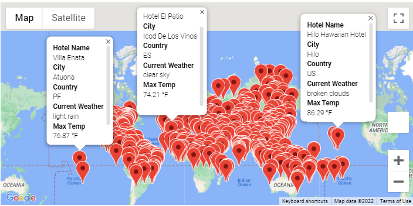
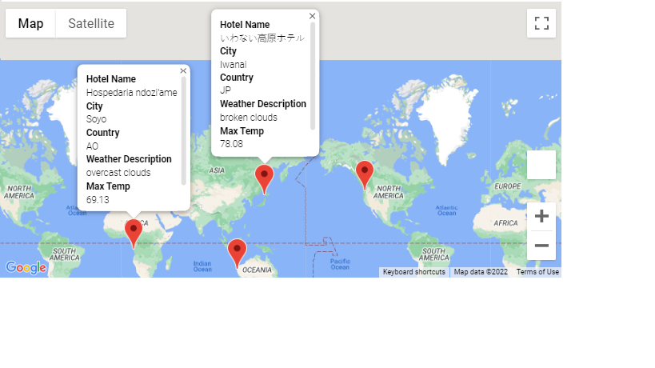

# World_Weather_Analysis

## Overview of Project
 
The purpose of this project was to upgrade the current app by adding the weather description to weather data, giving clients the option to filter data to their weather preferences which will be used to identify potential travel destinations and nearby hotels.  

### Results

The above map utilizes Google Maps API to filter and provide information the client may need regarding the weather and location of a specific location.

Popup markers with hotel name, city, country, weather description and max temp were included to visualize data or information at a glance rather than having to dig deeper.

